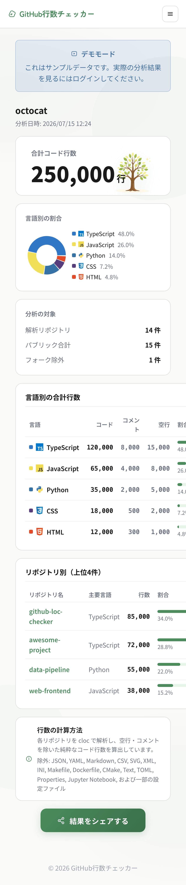
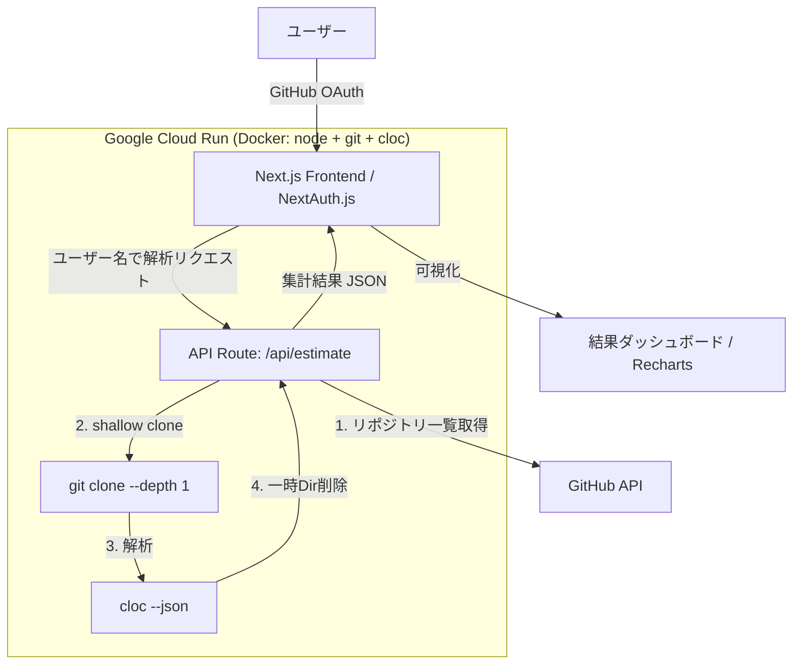

# 🌳 GitHub行数チェッカー (GitHub LOC Analyzer)

> GitHubの公開リポジトリを **実際にクローンして `cloc` で解析** し、空行・コメントを除いた「純粋なコード行数」を厳密に算出・可視化するWebアプリケーション。

<p align="center">
  
</p>

<p align="center">
  <a href="https://github-loc-checker-upzls4iyca-an.a.run.app/">🚀 デモを試す</a>
  &nbsp;·&nbsp;
  <a href="#-なぜ作ったか">なぜ作ったか</a>
  &nbsp;·&nbsp;
  <a href="#-工夫したこと技術的ハイライト">工夫したこと</a>
  &nbsp;·&nbsp;
  <a href="#-アーキテクチャ">アーキテクチャ</a>
</p>

---

## 📌 なぜ作ったか

このアプリは、就職活動と自分自身の技術の棚卸しの中で感じた **2つの課題** から生まれました。

1. **就活で「どの言語を、何行くらい書いたか？」と聞かれた。**
   感覚では答えられても、根拠のある数字を即答できませんでした。GitHubの言語統計は「バイト数」ベースで、実際に自分が書いた行数とは異なります。
2. **自分の技術を客観的に整理したかった。**
   これまでどの言語にどれだけ時間を投資してきたのか、リポジトリ横断で定量的に把握したいと考えました。

そこで、**「空行やコメントを除いた、実際に書いたコード行数」を正確に測って可視化する**ツールを自作しました。

---

## ✨ 主な機能

| 画面 | 説明 |
| --- | --- |
| **ログイン / デモ** | GitHub OAuthログイン、または認証なしでUIを体験できるデモモード |
| **入力** | GitHubユーザー名を入力して解析を実行 |
| **結果ダッシュボード** | 合計コード行数・言語別割合（ドーナツチャート）・言語別/リポジトリ別の詳細テーブル |
| **シェア** | 結果カードのPNG画像生成、X / Instagram へのシェア、動的OGP画像 |

### 結果ダッシュボード

<p align="center">
  
</p>

- **合計コード行数** を大きくハイライト表示
- **言語別の割合** をドーナツチャート＋凡例（言語アイコン付き）で可視化
- **言語別テーブル**：コード / コメント / 空行 を分けて表示
- **リポジトリ別テーブル**：コード行数の多い順にランキング表示
- 解析対象・パブリック合計・フォーク除外件数のサマリ

### シェア機能

<p align="center">
  
</p>

Canvas APIでその場でシェア用の画像を生成。X・Instagram用テキストのコピー、画像ダウンロードに対応しています。

### レスポンシブ対応

<p align="center">
  
</p>

モバイルではハンバーガーメニューと縦積みレイアウトに自動で切り替わります。

---

## 🛠 工夫したこと（技術的ハイライト）

ポートフォリオとして、特に力を入れた設計・実装のポイントです。

### 1. 「バイト数の推計」ではなく `cloc` による厳密なコード行数計測

GitHub APIの言語統計は **ファイルのバイト数** をベースにしており、実際に書いた行数とはずれます。
本アプリはバックエンド（コンテナ）内で各リポジトリを **`git clone --depth 1`（shallow clone）** し、**`cloc` コマンド**で解析することで、**空行・コメントを除いた純粋なコード行数**を算出しています。

```bash
git clone --depth 1 --quiet <repo_url> <tmp_dir>
cloc <tmp_dir> --json --quiet \
  --exclude-dir=node_modules,dist,build,.next,out,vendor,__pycache__,.venv,venv \
  --exclude-lang="Jupyter Notebook",JSON,YAML,Markdown,CSV,SVG,XML,...
```

- **ノイズの除外**：`node_modules` などの生成物ディレクトリや、JSON / YAML / Markdown / SVG など「手書きのロジックコードではない」言語を除外し、実力に近い数字を出す。
- **フォーク除外**：他人のコードであるフォークリポジトリは集計から除外。
- **言語名の正規化**：`TypeScript React` → `TSX` などに整形して見やすく集計。

### 2. Hybrid Cloud アーキテクチャ（Next.js × Cloud Run）

`git` と `cloc` というOSレベルのコマンドを実行する必要があるため、Next.jsアプリを丸ごと **Dockerコンテナ化して Google Cloud Run にデプロイ** しています。

- 認証・UI・重い解析処理を **Next.js の API Routes に集約**し、シンプルな1アプリ構成を維持。
- Dockerのマルチステージビルドで、ランタイムイメージに `git` と `cloc` をインストール。
- `output: "standalone"` で軽量なイメージを生成。

### 3. セキュリティ：最小権限とトークンの確実な失効

- **OAuthスコープを `read:user` のみに最小化**。パブリックリポジトリはトークン無しでもクローン可能なため、リポジトリへの書き込み権限などは一切要求しません。
- **ログアウト時に GitHub の Token Revocation API を呼び出し**、発行済みアクセストークンを確実に失効させます（`/api/auth/revoke`）。
- 解析用の一時ディレクトリは、成否にかかわらず **`finally` で必ず削除**（ストレージ逼迫と情報残留を防止）。

### 4. 堅牢なエラーハンドリング

- **GitHub APIのレート制限を検知**し、残り回数と **リセット時刻** をユーザーにわかりやすく提示。
- リポジトリ単位の `clone` / `cloc` 失敗は個別に `try/catch` で握りつぶし、**1つ壊れても解析全体は止まらない**設計。
- リポジトリごとに **60秒のタイムアウト** を設定。
- リポジトリ一覧は **ページネーション（`per_page=100`）** で全件取得。

### 5. シェア機能とバズ導線（動的OGP）

- **Canvas API** で結果ダッシュボードを1枚のPNGカードに描き起こし、その場でダウンロード／SNS共有できるように。
- 共有URL `/share?d=...` は結果データをエンコードして保持し、**Edge Runtime 上の `next/og`（Satori）で OGP画像を動的生成**。
- クローラー（ボット）には **OGP画像を見せ、人間だけをJSでアプリ本体にリダイレクト**する二段構えで、SNSでのプレビューと実利用の両立を狙いました。

### 6. UX上の工夫

- **デモモード**：GitHub認証なしでも、モックデータで結果画面を即座に体験できる（採用担当者がすぐ触れる）。
- **ローディングビュー**で解析中の状態を明示。
- モバイル対応・言語アイコン・ドーナツチャートなど、見た目でも「使いたくなる」ことを重視。

---

## 🏗 アーキテクチャ



### 処理フロー

1. GitHub OAuthでログイン（またはデモモード）
2. 対象ユーザーの公開リポジトリ一覧を取得（フォークは除外）
3. 各リポジトリを `git clone --depth 1` で高速クローン
4. `cloc` で言語別のコード / コメント / 空行を解析
5. 一時ディレクトリを即削除し、全リポジトリ分をマージして返却
6. フロントで合計・言語別・リポジトリ別に可視化

---

## 🧰 技術スタック

| 分類 | 使用技術 |
| --- | --- |
| フロントエンド | Next.js 16 (App Router) / React 19 / TypeScript |
| スタイリング | Tailwind CSS v4 / CSS Modules |
| 認証 | NextAuth.js (Auth.js) — GitHub Provider (OAuth 2.0) |
| バックエンド | Next.js API Routes (Route Handlers) |
| 解析エンジン | `git` + `cloc`（コンテナ内で実行） |
| 可視化 | Recharts / Canvas API / `next/og`（動的OGP） |
| インフラ | Docker（マルチステージビルド） / Google Cloud Run |

---

## 🚀 ローカルでの起動

### 前提

- Node.js 20+
- `git` および [`cloc`](https://github.com/AlDanial/cloc) がローカルにインストールされていること
  ```bash
  # macOS
  brew install cloc
  ```

### セットアップ

```bash
# 依存関係のインストール
npm install

# 環境変数を設定（下記「必要な環境変数」を参照して .env.local を作成）

# 開発サーバー起動
npm run dev
```

[http://localhost:3000](http://localhost:3000) を開いてください。

### 必要な環境変数（`.env.local`）

| 変数 | 説明 |
| --- | --- |
| `NEXTAUTH_URL` | アプリのベースURL（例: `http://localhost:3000`） |
| `NEXTAUTH_SECRET` | セッション暗号化用のランダム文字列 |
| `GITHUB_ID` | GitHub OAuth App の Client ID |
| `GITHUB_SECRET` | GitHub OAuth App の Client Secret |

### Docker（本番相当）で動かす

```bash
docker build -t github-loc-checker .
docker run -p 3000:3000 --env-file .env.local github-loc-checker
```

---

## 📁 ディレクトリ構成

```
src/
├── app/
│   ├── api/
│   │   ├── auth/[...nextauth]/   # NextAuth 設定
│   │   ├── auth/revoke/          # トークン失効API
│   │   ├── estimate/             # 解析のメイン処理（clone + cloc）
│   │   └── og/                   # 動的OGP画像生成 (Edge)
│   ├── share/                    # シェア用ページ（OGP + リダイレクト）
│   ├── layout.tsx
│   └── page.tsx                  # 画面遷移の制御
├── components/                   # LoginView / InputView / ResultView / ShareModal ...
├── lib/                          # demoData / languageIcons / shareUrl
└── types/                        # 型定義
```

---

## 📝 補足

- 解析対象は **公開リポジトリのみ** です。
- 行数は `cloc` による解析値であり、空行・コメントを除いた **コード行数** を表示します。

---

<p align="center">© 2026 GitHub行数チェッカー</p>
